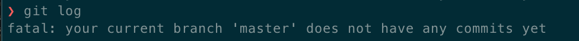
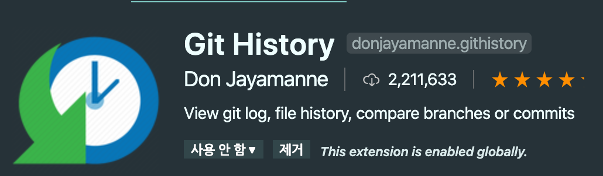
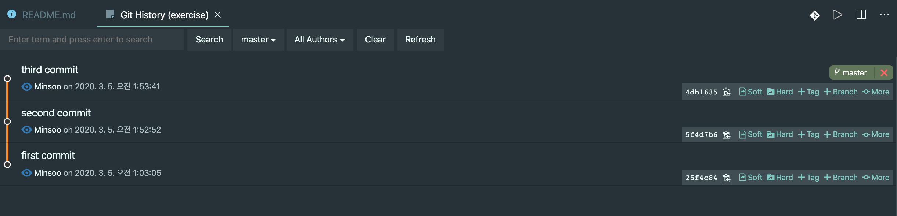
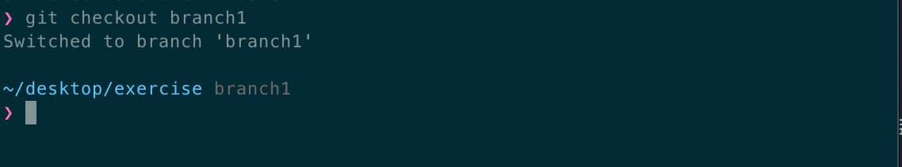
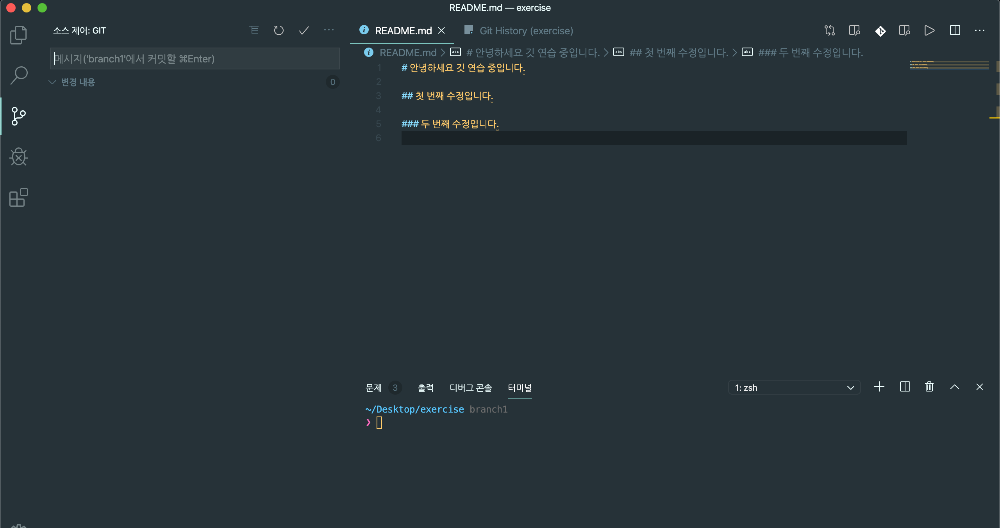
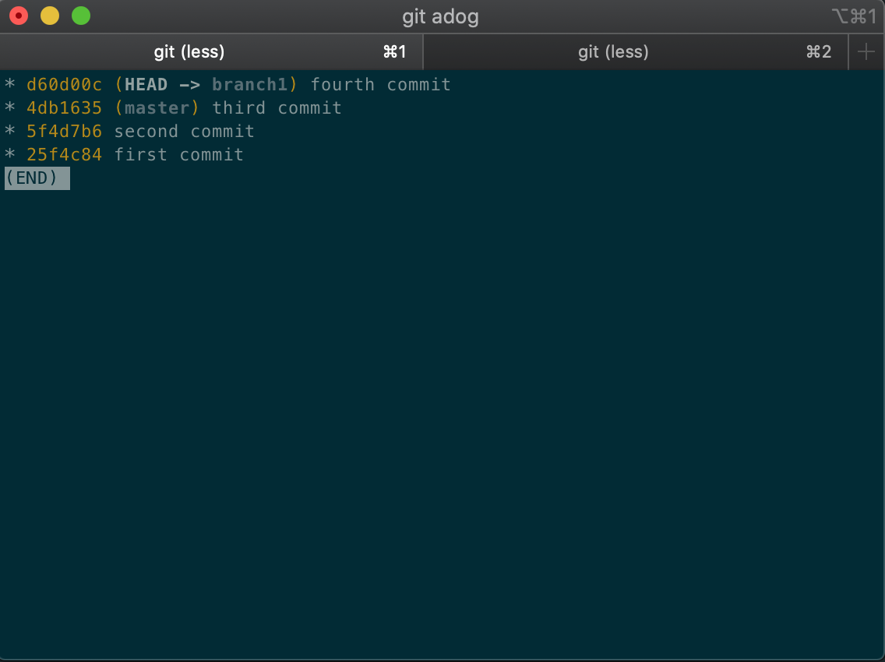
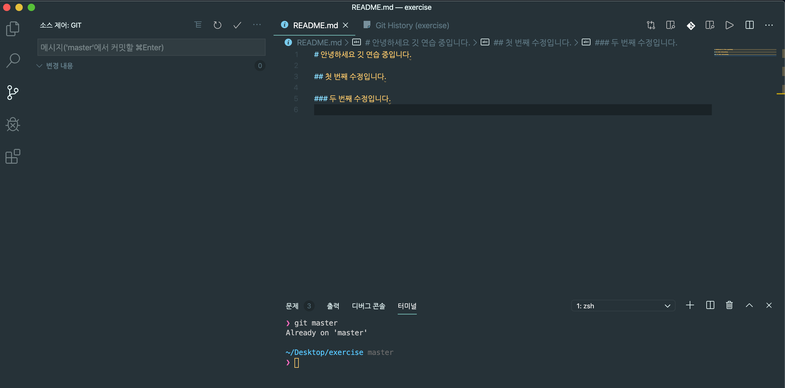

깃 공식 문서 : <https://git-scm.com/book/ko/v2>

깃을 배우다 보면 브랜치(branch)라는 개념이 등장하게 됩니다.
브랜치는 무엇이고
브랜치로 무엇을 할 수 있고 어떻게 하는 지 알아봅시다.

- 순서

  1. 개요
  2. master?
  3. git log / git adog
  4. branch 생성
  5. branch 이동
  6. branch 삭제
  7. branch 활용

- 배우게 되는 명령어
  1. git log (git adog)
  2. git branch (git branch -d)
  3. git checkout

# 1. 개요

브랜치(branch)는 영단어 뜻 그대로 '가지'라는 뜻입니다.  
혹시 vscode를 사용한다면 이런 아이콘을 본 적이 있을 겁니다!  


왼쪽은 vscode 아이콘이구 오른쪽은 git 로고인데 어떤가요? 좀 가지 같나요?  
이렇게 브랜치는 깃에 있어서 로고로 그려질만큼 핵심적인 기능이자 꼭 제대로 짚고 넘어가야할 중요한 기능입니다.

## 2. What is 'master'

저희가 어떤 디렉토리를 선택해서  
깃 레포짓토리로(repository)로 만들고자 할 때 쓰는 명령어가 어떤 것이었죠?

```bash
$cd ~/해당디렉토리위치
$git init
```

이렇게 `git init`명령어로 git을 시작하게 되면 터미널(윈도우는 powershell 등등)  
콘솔창에 이런 문구가 보일 겁니다. (저는 iTerm2로 zsh 를 사용합니다. )  
  
여기서 master가 바로 깃을 시작하면 자동으로 생성되는 첫번째 브랜치입니다.  
나무로 따지면 기둥이라고 이해하시면 쉽습니다!  
나무가 물과 양분을 먹으면 점점 자라나듯이,  
저희가 코드를 추가하고 변경하고 삭제할때마다 이 기둥이 점점 자라난다고 생각하시면 됩니다.  
그럼 한번 어떻게 자라나는 지 확인 해볼까요?

## 3. git log / git adog

우선 전과 후를 비교하기 위해 `git log`라는 명령어를 배우고 갑시다!  
로그(log)라는 말은 영단어 뜻으로 '뿌리'라는 의미가 있죠? 깃은 '분산 버전 관리 시스템' 이라는 타이틀에 맞게 기본적으로 해당 디렉토리의 모든 변경사항을 추적해줍니다.  
  
그 변경 사항들을 추적해서 가시적으로 사용자에게 보여주는 명령어가 바로 `git log`입니다.  
뿌리까지 깊게 파고든다... 뭐 이런거죠 :smile: 그럼 바로 콘솔창에 입력해봅시다.
  
  
  
혹시 이런 에러가 뜨셨다면 자연스러운 현상입니다. 아직 기둥이 자라나질 않아서 추적할 뿌리가 없는 상태이니깐요. 영어 읽어보니 커밋한게 아직 하나도 없어서 에러라네요.  
  
`커밋을 안 했다 == 물과 양분을 안 줬다 == 기둥이 안 자랐다.`
  
이해가 되시나요??
  
그럼 이제 README\.md 파일 하나를 생성해줌으로써 커밋 변경 사항 하나를 만들어 줍시다 README\.md
작성하고 저장을 해주시면, (에디터의 자동저장 기능을 사용하셔도 됩니다.)  
vscode의 깃 아이콘에 1이라는 숫자가 추가 되고 주황 색으로 U라고 뜨죠?!  
여기서 1의 의미는 현재 디렉토리(git repositroy)안에서 변경된 파일의 개수를 의미하고  
각각의 알파벳은
  
    U : Untracked 추적되지 않은 상태
    D : Delete 삭제
    A : Added 추가
    M : Modified 수정
    C : Confilct 충돌로 인해 merge가 안 될 때
    R : Renamed 파일 이름 변경
  
이렇게 6가지의 의미입니다.
  
다른 건 몰라도 U와 M은 자주 보게 될테니 뜻 정도는 알아두시는 게 좋습니다 !
  
이제 다시 본론으로 돌아와서 커밋을 하고 다시 `git log` 명령어를 입력해 봅시다.
  
```bash
#  ~/desktop/exercise

$git add .
$git commit -m "first commit"
$git log
```
  


첫 번째 줄에 있는 무지막지한 숫자와 알파벳의 조합은 이 커밋의 고유 이름입니다.
  
커밋끼리 구별하기 위한 이 조합은 전세계 어느 사람의 커밋과도 겹치지 않게 끔 설계 되었습니다.(그렇다고 합니다)  
실제로 이 긴 값을 다 사용할 수 는 없으니 앞에 7자리의 해시 값만을 뽑아서 사용합니다.
  
(위의 경우 25f4c84)
  
 그리고 (HEAD->master)라고 되어 있는 부분이 이 git의 특수한 포인터 역할인데요,  
 추후에 브랜치 생성을 통해 실습해 볼 예정이지만 간단하게 설명드리면
  
> **_지금 현재 작업중인 로컬 브랜치를_** 가리킨다고 생각하시면 됩니다!

지금 저희는 깃을 생성하면 자동으로 생기는 master 브랜치에서 작업하고 있으니 HEAD가 master 브랜치를 가리키는 게 당연하겠죠??
  
두 번째 줄은 작성자입니다. 만약 아직 유저 등록을 안 해 놓았다면  
(참고로 나가는 명령어는 알파벳 q 입니다! ㅂ 누르면 안 돼요 ㅠㅠ)
  
```bash
$git config --global user.name "유저 이름"
$git config --global user.email 유저이메일@example.com
```
  
`git config` 명령어를 통해 저장하시면 됩니다!
  
세 번째줄은 commit을 한 날짜와 시간을 보여줍니다. (늦은시간이네요)
  
그리고 마지막은 이제 커밋 메세지를 보여줍니다. <br/>
이 커밋 메시지에는 여러가지 습관이나 개개인의 특성이 반영되기 마련이라 <br/>협업에 악영향을 끼치기 쉽습니다. <br/>이에 널리 알려진 깃 커밋 메시지 7가지 규칙을 간단하게 소개만 하고 넘어가겠습니다.
  
1. 제목과 본문을 빈 행으로 분리한다.

2. 제목 행을 50자로 제한한다. (영문기준)

3. 제목 행 첫 글자는 대문자로 쓴다.

4. 제목 행 끝에 마침표를 넣지 않는다.

5. 제목 행에 명령문을 사용한다.

6. 본문을 72자 단위로 개행한다.

7. 어떻게 보다는 무엇과 왜를 설명한다.
  
이제 커밋이 두개 세개 늘어 났을 때 어떻게 보여지는지 보겠습니다!
  

  
음 나무 같아 보이진 않죠...? `git log` 명령어에는 다양한 옵션들이 존재하는데 그중 git adog라고 불리는 옵션에 대해서 소개해드리겠습니다!
  
```bash
$git config --global alias.adog "log --all --decorate --oneline --graph"
```
  
config는 설정하겠다는 의미의 명령어이구  
`--global` 옵션은 이 디렉토리 (work tree라고도 부릅니다) 뿐만 아니라 전역적으로 설정하고 싶을 때 붙이는 옵션이며  
  
`alias.adog` 라는 설정이 이제 'alias. 뒤에 있는 단어의 의미는 다음과 같다.' 라고 알려주는 단축키 설정입니다.
  
그럼 이제 `git adog` 라고 명령하시면 `adog` 를 `log -- all --decorate --oneline --graph`라고 바꿔서 실행하게 되는 거죠.  
그럼 이 옵션들을 하나하나 설명 해 드리고 넘어가겠습니다.
  
    --all 모든 커밋들을
    --decorate 이쁘게 꾸며서
    --oneline 커밋메세지 + 커밋 헤시 값 + 브랜치 위치 를 한 줄에 표시하고
    --graph 그래프로 가시화해서 보여줘
  
무슨 말인지 감이 잘 안 오실 수 있는데 한 번 확인해 봅시다!
  

  
\*가 생시면서 한줄에 표시 되니까 가시적으로 보기도 편해졌죠?? all decorate oneline graph 의 앞 글자를 따서 만든 `git adog` 명령어였습니다!  
또 다른 방법으로 git log를 가시적으로 확인할 수 있는데요.
  
바로 vscode 'Git History'라는 확장입니다.
  

  
설치를 하고 나면 vscode 에디터에서 git log 를 볼 수 있습니다.
  

  
우측 상단에 git 로고가 보이나요? 클릭해보시면
  

  
git adog 명령어와 비슷하지만 gui 환경에서 가시적으로 볼 수 있다는점, 다양한 편의 기능들이 존재하는 점에서 추천드리고 싶은 확장 프로그램입니다!
이외의 기능 :
  
- 특정 커밋에서 브랜치 생성
- 브랜치 삭제
- 커밋 되돌리기 reset (hard/ soft )
- 변경 사항 비교 등등
  
여타 GUI 데스크톱 프로그램에 비교해도 (Sourcetree / GitHub Desktop 등등) 필요한 기능들을 모두 vscode 안에서 해결할 수 있다는 점에서 굉장히 매력적이었습니다.
  
각설하고 이제 본격적으로 브랜치를 생성해봅시다! (?!)
  
## 4. branch 생성
  
깃의 공식 문서 <https://git-scm.com/book/ko/v2/Git-%EB%B8%8C%EB%9E%9C%EC%B9%98-%EB%B8%8C%EB%9E%9C%EC%B9%98%EB%9E%80-%EB%AC%B4%EC%97%87%EC%9D%B8%EA%B0%80> 에서는 이렇게 정의하고 있습니다.
  
    Git의 브랜치는 커밋 사이를 가볍게 이동할 수 있는 어떤 포인터 같은 것이다.
    기본적으로 Git은 master 브랜치를 만든다.
    처음 커밋하면 이 master 브랜치가 생성된 커밋을 가리킨다. 이후 커밋을 만들면 master  브랜치는 자동으로 가장 마지막 커밋을 가리킨다.
  
무슨 말인지 이해가 잘 안 되신다면 실습을 통해 하나 하나 익혀가보도록 합시다!
  
브랜치를 생성하는 명령어는  
`git branch 브랜치이름` 입니다. 어떻게 생성되는 지 한 번 직접 명령 해보면
  

  
무소식이 희소식이라고, 반응이 없는게 정상입니다 :smile:
  
현재 로컬 저장소에 생성되어 있는 브랜치를 보는 명령어는 `git branch` 입니다.
  

  
예상대로 master와 방금 만든 branch1 이 확인이 되네요!  
근데 master에 \* 표시가 되어있죠, 이 \* 표시가 아까 log 명령어에서 확인했던  
HEAD 포인터의 역할이라고 보시면 됩니다!
  
## 5. branch 간의 이동
  
이제 만든 브랜치로 이동해볼까요? 브랜치 간의 이동을 하게 해주는 명령어는 `git checkout` 입니다.  
호텔에서 숙박을 마치고 나올 때 'checkout' 한다고 하죠?  
이처럼 현재 브랜치에서 나오고 다른 브랜치로 이동하고 싶을 때 `git checkout` 이라는 명령어를 사용하시면 됩니다.
  

  
master라고 쓰여있던 회색 글씨가 branch1이라고 바뀐 것을 볼 수 있을겁니다! `git branch` 명령어에서도 마찬가지로 \*표시와 주황글씨가 branch1으로 옮겨진 것을 확인 하실 수 있으실 겁니다.
  
## 6. branch 삭제
  
생성을 배웠으면 삭제를 배우는 게 순서겠죠?! 브랜치 삭제 명령어는  
`git branch -d 삭제하려는브랜치이름` 입니다.
  
여기서 알고 가셔야 할 옵션이 -d 라는 옵션인데 만약 브랜치가 가리키는 프로젝트에서 커밋되지 않은 변경사항이 존재할 경우에는 삭제가 되지 않고 오류 메세지를 띄웁니다.
  
이를 해결하기 위한 방법이 세 가지 정도가 있는데
  
    1. 변경사항을 되돌린다. -> git restore
    2. -D 옵션을 사용해서 강제로 삭제한다.
    3. 스테이징 및 커밋을 모두 완료하고 삭제한다.
  
첫번째 방법이나 세번째 방법도 어렵지는 않지만 브랜치 삭제하는데 -D 옵션만 주면 되니  
저는 2번 방법을 추천드립니다!
  
삭제를 하실 때 또 유의 하셔야 할 점이 삭제를 하려는 브랜치에 계시면 안 되고 checkout을 통해 다른 브랜치로 옮겨간 후 삭제를 하셔야 합니다.
  
에러 화면)

  
또 한 가지 드리고 싶은 팁은 master로 checkout을 하실때에는
  
```bash
#  ~/desktop/exercise branch1
$git master
```
  
명령어만 입력하셔도 가능하시다는 점과 생성과 checkout을 동시에 하시고 싶으실 때에는
  
```bash
#  ~/desktop/exercise master
$git checkout -b branch2
```
  
이렇게 -b 옵션을 주시면 됩니다!
  
## 7. branch 활용
  
브랜치를 깃의 공식 문서처럼 포인터라고 이해하셔도 좋지만  
저는 그냥 하나의 '가지'라고 생각하는게 제일 이해하기 쉽다고 생각합니다.  
무슨 말인지 실습을 통해 바로 이해해 보겠습니다.
  
아까 만든 branch1으로 이동한 후 에디터를 켜보겠습니다.  
(여기서부터는 vscode의 터미널 창에서 진행하겠습니다.)
  

  
왼쪽 세번째 아이콘을 클릭해보시면 현재 브랜치가 어떤 브랜치 인지 확인 할 수 있습니다.
  
     메시지('branch1에서 커밋할....')
  
이는 master 브랜치일 경우엔 'master' 에서 커밋할... 이라고 뜨게 됩니다.
  
이제 branch1에서 README 파일에 변화를 주고 `git status`로 터미널에서도 상태를 확인해 보겠습니다.
  

  
파일의 이름 옆에 M (Modify) 도 생기고 (4는 markdown 문법 경고입니다 ㅎㅎ..)
  
터미널에서도  
변화는 생겼는데 Changes  
스테이징이 안 됐다 not stageed  
커밋해라 for commit (커밋을 위한 스테이징이 안 되었다)라고 하고
  
커밋할거면 git add  
변경사항 취소할거면 git restore  
하라고 친절하게 설명해 놓았네요.
  
저희는 커밋을 해서 변경사항을 확인 할 거니까 스테이징 후 커밋까지 해놓겠습니다.
  

  
이제 기둥(master)에서 가지가 하나 삐져나와서 자라나고 있습니다! 저희는 현재 checkout을 branch1에 해두었으니 HEAD 포인터가 branch1을 가리키고 있는 것까지 잘 확인이 되었습니다.
  
이제 궁금한 점이 그럼 이 `브랜치`를 왜 사용하는지 아직 안 와 닿으실 수 있습니다.  
만약 여러분이 곤충이고 (응?)  
이 Working Tree를 하나의 나무라고 생각하면  
여러분이 기둥에 있을때 가지에 있는 나뭇잎을 보거나 먹을 수 있을까요? (비유 죄송합니다.)
  
실습을 위해 직접 기둥으로 가봅시다
  
```bash
#  ~/destop/exercise branch1

$ git master
```
  

  
branch1에서 만든 나뭇잎이 보이지 않는 것을 볼 수 있습니다.
  
이처럼 브랜치는 버전관리를 좀 더 효율적으로 하기 위한 깃의 기능입니다.  
  
예를 들어 개발자 두 명이 협업을 할 때에는 하나의 기둥에서 큰 브랜치를 두 개 따서  
각자 작업할 수 있게 해주는 거죠. 서로에게 영향을 끼치지 않고.  
  
하나의 커다란 기둥을 자라게 해주는 작업은 merge 라고 합니다.  
이는 범위를 벗어나니 다음 포스팅에서 자세히 또 다루겠습니다!
  
감사합니다!!
