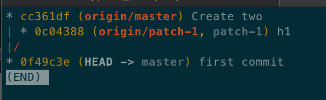

PR 하는 방법 : https://json.postype.com/post/210431
fork한 레포 최신 동기화 : https://wayhome25.github.io/git/2017/07/08/git-first-pull-request-story/

협업을 하다 보면 PR이라는 단어가 많이 나온다.
PR은 무엇이고
PR은 어떻게 하는 것인지 알아보자

---

# PR 이란?

PR을 이해하기에 앞서 P에 해당하는 Pull을 먼저 이해할 필요가 있다.

Pull 이란 원격 저장소의 데이터를 로컬 저장소에 가져와 병합하는 git 명령어 중 하나이며 충돌이 없다면 자동으로 merge된다.

git을 사용하다보면 cli 창이나 gui 창에서 orgin/master 와 master의 위치가 상이한 경우를 본 적이 있을 것이다. 이러한 경우는

1. 다른 브랜치에서 작업한 코드를 master에 merge했을 경우
2. 원격 저장소에서 직접 코드를 추가하거나 수정했을 경우 등등

이 있을 것이다.
이럴 경우엔 작업하던 브랜치에 변경된 내용을 적용해야 할 경우가 생길텐데 이를 Pull이 해결해준다.

cli 창을 보며 어떻게 진행되는 지 살펴보자

